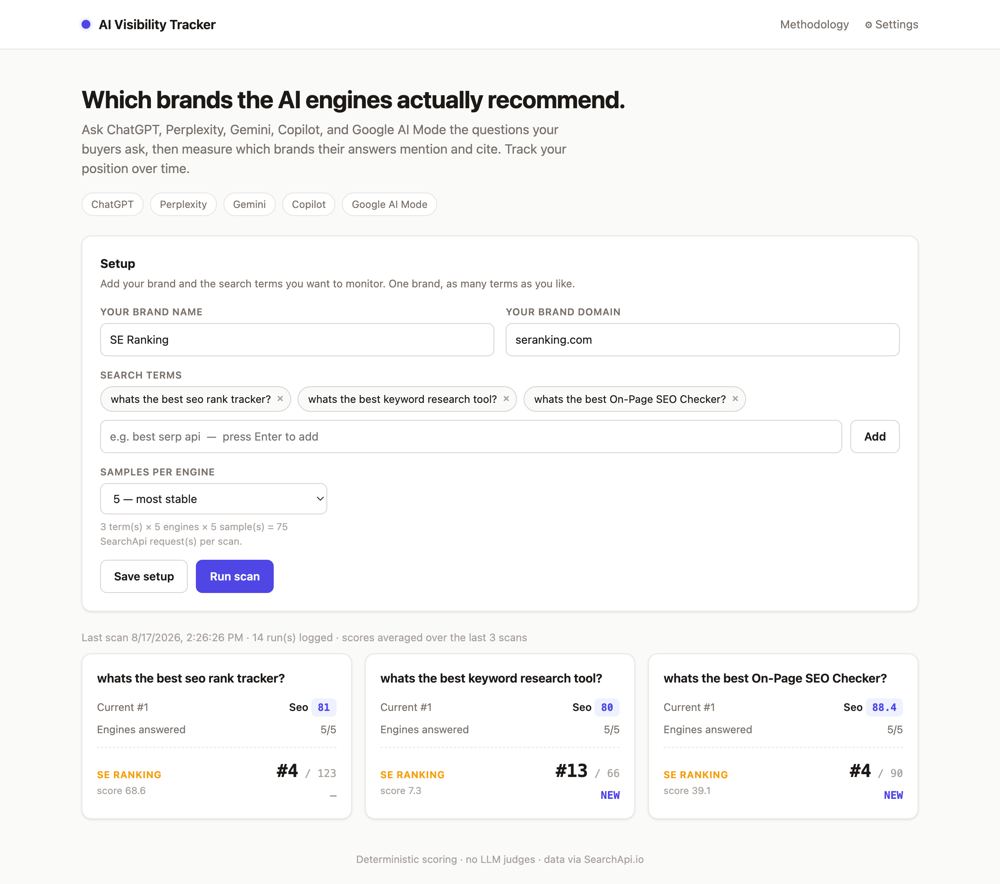

# AI Visibility Tracker

Track which brands the major AI answer engines actually mention and cite, score
that visibility deterministically, and watch it move week over week.

Ask **ChatGPT, Perplexity, Gemini, Copilot, and Google AI Mode** the questions
your buyers ask, then measure which brands their answers name and link. One brand
of yours, as many search terms as you want. All five engines are queried through
[SearchApi.io](https://www.searchapi.io).



## What you get

- **Dashboard.** A card per search term: the current #1 brand, where your brand
  sits, and how it moved since the last scan.
- **Per-term leaderboard.** Every brand the engines have named or cited, ranked by
  AI Visibility Score, with mention rate, citation rate, share of voice, and
  movement. Brands stay on the board after they stop showing, so you can watch
  them fall and climb. Your brand is always on it.
- **"Do the engines agree?"** A brand by engine matrix showing which engines named
  each brand, so you can tell broad consensus from one engine's pet pick.
- **Raw data view.** Every answer, every sample, and the exact SearchApi JSON each
  board was built from.
- **Methodology page.** The full scoring formula, in the open.

## Prerequisites

| Requirement | Notes |
| --- | --- |
| **Node.js 18 or newer** | Check with `node --version`. No build step, no bundler. |
| **A SearchApi.io API key** | Free tier available at [searchapi.io](https://www.searchapi.io). Only needed to run live scans; the demo mode below works without one. |
| **A browser** | The UI is framework-free HTML, CSS, and vanilla JS. |

The only runtime dependency is Express. Data is stored as flat JSON files on
disk, so there is no database to set up.

## Install

```bash
git clone https://github.com/<your-username>/ai-visibility-tracker.git
cd ai-visibility-tracker
npm install
npm start
```

Open <http://localhost:4173>.

### Try it without an API key

Seeds two fabricated runs through the real scorer, so you can click around a
populated dashboard before spending any credits:

```bash
npm run seed:demo
npm start
```

### Adding your API key

Either works, and you can switch at any time:

- **In the app.** Click **⚙ Settings**, paste the key, save. It is stored in
  `data/settings.json`, which is gitignored.
- **As an environment variable.** Set `SEARCHAPI_API_KEY`, for example in a
  `.env` file (see `.env.example`).

A key entered in Settings takes priority. Clear it and the app falls back to the
environment variable.

## Using it

1. **Set your brand.** Name plus domain, for example `SE Ranking` and
   `seranking.com`. The domain is what identifies you in citations.
2. **Add search terms.** Use the questions your buyers actually type, phrased
   naturally: "whats the best seo rank tracker?" beats "seo rank tracker". You are
   querying answer engines, not a keyword tool.
3. **Pick samples per engine.** 1, 3, or 5. More samples means a steadier score.
   See [Sampling](#sampling) for why this matters more than it looks.
4. **Run scan.** Cost is `terms × 5 engines × samples` SearchApi requests. Three
   terms at 5 samples is 75 requests.
5. **Read the board.** Click any term card for the full leaderboard, the engine
   agreement matrix, and the raw answers.
6. **Scan again on a schedule.** Weekly is a sensible cadence. Scores are averaged
   over the trailing three scans, so the trend gets more trustworthy as history
   builds.

### Keeping the board to real brands

You want companies that sell the product, not the forums and comparison sites the
engines also cite. Two mechanisms handle that:

- **Brand identity by domain.** A brand is keyed by its registrable domain taken
  from the real citation link, so `SerpApi`, `serpapi`, and `serpapi.com` collapse
  into one brand instead of three.
- **Denylist.** A curated list of non-vendors (Google, Reddit, YouTube, Wikipedia,
  GitHub, plus review and comparison sites like G2, Capterra, and TechRadar) never
  reaches a leaderboard. See `lib/denylist.js`. Anything it misses, hit **exclude**
  on the row and it drops from every board; restore it from the "Excluded by you"
  strip. Your additions live in `data/denylist.json`.

Leaderboards are derived from each run's raw answers **at read time**, so denylist
changes and exclusions apply retroactively to your whole history. No re-scan
needed.

## Methodology

### Mention vs. citation

These are different kinds of visibility, so they are tracked separately. A brand
can be cited as a source without being recommended, and recommended without its
site being linked.

- **Mentioned:** the brand's name appears in the answer text on a word boundary.
  Citation link URLs are stripped first, so a domain inside a link is never
  mistaken for prose.
- **Cited:** one of the sources the engine links resolves to the brand's own
  registrable domain.

No LLM judges anything. Detection is string and domain matching against a curated
list, which is what keeps results reproducible.

### The score

```
score = 100 × ( 0.70 × mention_rate + 0.15 × citation_rate + 0.15 × position_factor )
```

- **mention_rate:** share of the term's answers that mention the brand
- **citation_rate:** share that cite the brand's domain
- **position_factor:** mean of `1/position` over answers that mention it, so being
  named first beats being named fifth

**Share of voice** is the brand's share of all brand mentions for that term in the
run.

### Sampling

AI answers are non-deterministic. Ask the same question twice and the brand list
changes. So each engine is queried several times per scan (default 3) and the
results are averaged: within each engine first, then across the engines that
answered, so every engine carries equal weight regardless of how many samples it
returned.

### Smoothing across scans

Sampling within a scan is not enough on its own. A mention rate is a proportion
estimated from a limited number of draws (5 engines × 5 samples = 25 answers at
the default), so it carries real sampling error, and that error is largest for
brands mid-board, which is where most brands sit.

Measured on live scans, a brand averaging an 18% mention rate scored anywhere from
4.9 to 24.8 across scans taken minutes apart, with nothing underneath it changing.
The observed spread matched what binomial sampling noise predicts, engine by
engine. It was noise, not movement.

So `score`, `mention_rate`, `citation_rate`, and `position_factor` are **averaged
over the trailing 3 scans**, which cuts run-to-run standard deviation by roughly
2.8x. Matching that by sampling harder would take about 24x the API requests per
scan. Each row still shows its own single-scan value underneath, and the trend
line uses the same trailing average as the headline number.

The trade-off is deliberate: a genuine change takes about three scans to show in
full rather than appearing instantly. Change the window with `SMOOTH_WINDOW` in
`lib/board.js`, or set it to `1` to disable smoothing entirely.

### What we send, and what we don't

Each request carries only `{ engine, q: <your search term> }`. No location, no
system prompt, no extra context.

One caveat worth stating plainly: because no location is sent, four of the five
engines resolve geography however SearchApi's infrastructure does, and they do not
report it back. Google AI Mode is the exception, defaulting to `gl=us` and
`hl=en`, which it echoes in the response. If you need results pinned to a specific
market, add the parameter in `lib/searchapi.js` and confirm the engine honours it.

## How it runs

A scan walks through five stages. Everything after the API call is deterministic
and re-runnable.

```
your search term
        │
        ▼
query 5 engines × N samples          lib/runner.js, lib/searchapi.js
        │
        ▼
read each answer: text + cited links lib/searchapi.js
        │
        ├──► detect mentions (prose, word boundary)   lib/scoring.js
        └──► detect citations (link → domain)         lib/scoring.js
        │
        ▼
average samples, then engines        lib/scoring.js
        │
        ▼
average the trailing 3 scans         lib/board.js
        │
        ▼
leaderboard, ranked by score
```

Runs are stored as **raw answers**, not as computed scores. The board is rebuilt
from that raw text on every page load, which is why changing the denylist, the
weights, or the smoothing window updates your entire history immediately.

| File | Role |
| --- | --- |
| `lib/engines.js` | The five engines and their SearchApi slugs |
| `lib/searchapi.js` | Queries one engine, normalizes answer text and cited sources |
| `lib/scoring.js` | Mention and citation detection, plus the score |
| `lib/brands.js` | The persistent brand log and citation-based discovery |
| `lib/denylist.js` | Non-vendor domains that never reach a leaderboard |
| `lib/board.js` | Per-term board assembly and cross-scan smoothing |
| `lib/runner.js` | Runs all engines for all terms, builds each leaderboard |
| `lib/store.js` | Flat JSON storage under `data/` |
| `lib/demo.js` | Seeds fabricated runs through the real scorer |
| `server.js` | Express server and JSON API |
| `public/` | Dashboard, term page, raw data view, methodology |

Everything you own lives in `data/`, which is gitignored: `config.json` (brand and
terms), `settings.json` (your API key), `registry.json` (the brand log),
`denylist.json` (your exclusions), and one file per run under `data/runs/`.

## License

MIT
